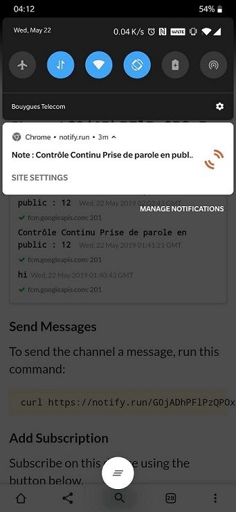

# Check-news-marks

This script is an afternoon project which goal is to send a notification for anyone interested when a new mark available. 

## Usage

Go to the notify-send website and register the device where you want to get the notification. It's as simple as that.

## How it works

The script runs on a VPS. To detect changes it logs periodically into our university website and parse the contents of the page with the python library BeautifulSoup. It check the results against an ealier version and notify for every change. The notification is implemented with notify-send : the website send a notification by the browser that is displayed on the device. 

## Contributing
Pull requests are welcome. For major changes, please open an issue first to discuss what you would like to change.

## License
[MIT](https://choosealicense.com/licenses/mit/)

